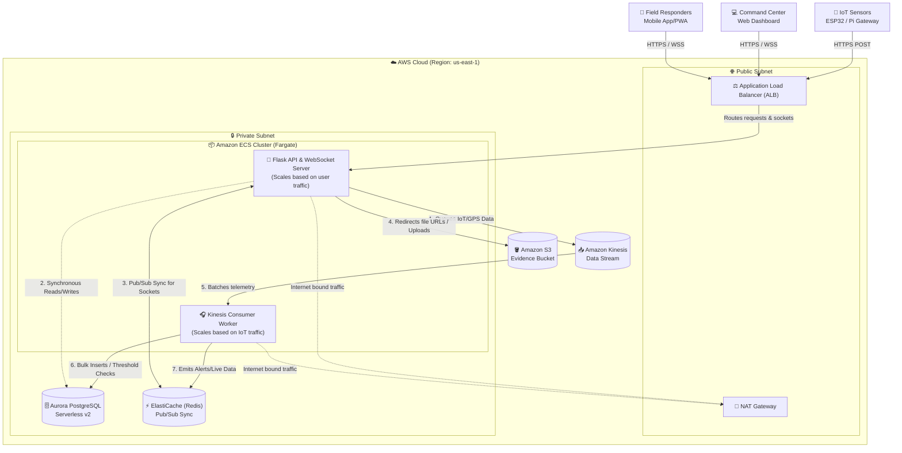

# ResQNet AWS Cloud Architecture

This document details the highly scalable, high-volume cloud architecture designed for the ResQNet crisis management platform. It explains the system's topology, the rationale behind our technology choices, and instructions for provisioning the infrastructure using Terraform.

---

## 1. Architectural Paradigm: Modular Monolith with Decoupled Workers

To achieve massive scale without inheriting the severe complexities of a full microservices mesh (e.g., distributed transactions, network latency between micro-DBs), we adopted a **Modular Monolith with Decoupled Processing**.

### Why this approach?
*   **Scale Where It Matters:** The heaviest load on a crisis system is data ingestion (millions of IoT sensor pings and GPS updates). By separating the REST/WebSocket API from the heavy database-writing processes, we can scale ingestion workers independently of the API servers.
*   **Simplicity:** Both the API and the worker share the same codebase and the same PostgreSQL database, avoiding distributed database complexities while still acting like independent microservices at runtime.

---

## 2. Core AWS Components & Rationale

| Component | AWS Service | Rationale for Selection |
| :--- | :--- | :--- |
| **Compute / Hosting** | **Amazon ECS (Fargate)** | **Zero Server Maintenance:** Fargate is a serverless container engine. AWS manages the underlying OS and instances. **Instant Scaling:** During a sudden crisis, Fargate can spin up dozens of containers instantly without waiting for EC2 virtual machines to boot. |
| **Primary Database** | **Aurora Serverless v2 (PostgreSQL)** | **High Concurrency & Auto-scaling:** Replaced local SQLite to eliminate database lock contention. Aurora v2 scales compute capacity up instantly during traffic spikes and scales down to save costs during quiet periods. |
| **High-Volume Ingestion** | **Amazon Kinesis Data Streams** | **Decoupled Write-Path:** Instead of writing every GPS ping and IoT stream directly to the database (which would overwhelm it during a disaster), the API rapidly pushes payloads into a Kinesis queue. A background worker pulls from this queue to perform optimized bulk inserts. |
| **WebSocket Sync** | **Amazon ElastiCache (Redis)** | **Multi-Container Broadcasting:** Because the API runs across multiple Fargate containers, a WebSocket message sent to one container must reach clients connected to other containers. Redis acts as a Pub/Sub message broker to synchronize Flask-SocketIO events across all instances. |
| **File Storage** | **Amazon S3** | **Infinite, Durable Storage:** Replaces local disk storage for evidence images and videos. The backend securely redirects file requests to S3, offloading bandwidth and memory usage from the Flask servers. |

---

## 3. Cloud Architecture Diagram

The following diagram illustrates the flow of traffic, the network topology, and how components communicate within the AWS Virtual Private Cloud (VPC).



### Communication Flow:
1.  **Ingestion Flow:** IoT sensors and Field Responders send data to the API. The API instantly publishes the payload to **Kinesis** and responds with `202 Accepted`.
2.  **Processing Flow:** The **Consumer Worker** reads from Kinesis, processes thresholds, writes to **Aurora PostgreSQL**, and if an alert triggers, emits a message to **Redis**.
3.  **Broadcast Flow:** **Redis** broadcasts the alert to all connected **API** containers, which push it to the Command Center dashboards via WebSockets.

---

## 4. Terraform Configuration & Deployment Guide

We use **Terraform** to automate the provisioning of all the above resources.

### A. Prerequisites
1.  Install [Terraform CLI](https://developer.hashicorp.com/terraform/downloads).
2.  Install the [AWS CLI](https://aws.amazon.com/cli/) and configure your credentials (`aws configure`).

### B. Configuring Variables
Terraform variables are defined in `terraform/variables.tf`. To customize them without modifying the source code, create a file named `terraform.tfvars` inside the `terraform` directory.

**Create `terraform/terraform.tfvars`:**
```hcl
# AWS Region
aws_region = "us-east-1"

# Environment tag
environment = "production"

# Aurora Serverless v2 Scaling (0.5 ACU = ~1GB RAM)
aurora_min_capacity = 0.5
aurora_max_capacity = 4.0

# Database Credentials
db_username = "resqnet_admin"
db_password = "YourSuperSecurePassword123!"

# VPC Network Configuration
vpc_cidr = "10.0.0.0/16"
```

### C. Deployment Steps

Navigate to the terraform directory:
```bash
cd terraform
```

**1. Initialize Terraform**
Downloads the AWS provider plugins.
```bash
terraform init
```

**2. Review the Plan**
Validates your configuration and shows you exactly what resources AWS will create.
```bash
terraform plan
```

**3. Apply the Infrastructure**
Provisions the VPC, RDS, ElastiCache, Kinesis, S3, and ECS clusters.
```bash
terraform apply
```
*(You will be prompted to type `yes` to confirm).*

### D. Outputs
After applying, Terraform will output critical information needed for your application. You can view these anytime by running `terraform output`:
*   `alb_dns_name`: The public URL to access your API/Dashboard.
*   `rds_endpoint`: The database connection string host.
*   `redis_endpoint`: The ElastiCache connection string host.
*   `s3_bucket_name`: The generated name of your S3 bucket.
*   `kinesis_stream_name`: The name of the ingestion stream.
