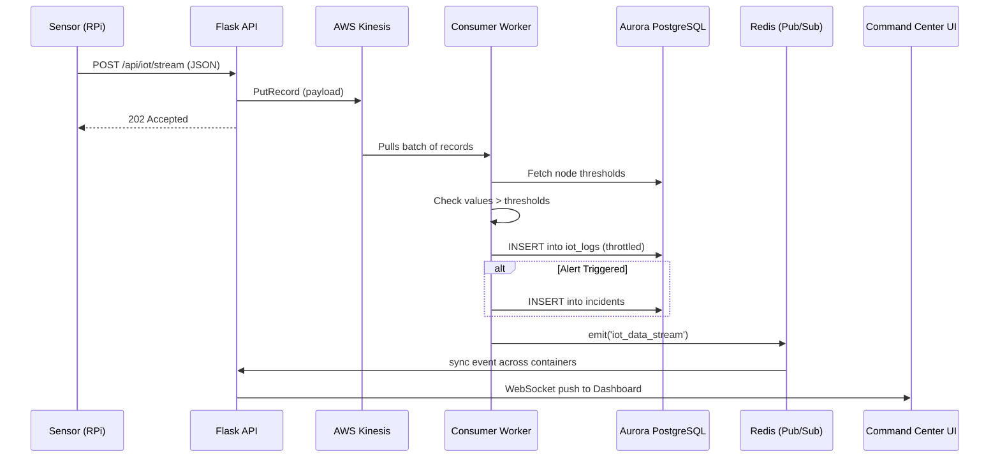
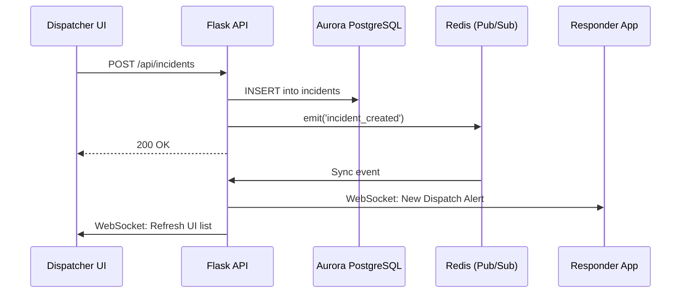

# ResQNet Data Flow & Service Integration Guide

This document provides a deep dive into the specific data flows for each major feature of the ResQNet system. It explains what data is generated, where it comes from, how it moves through the cloud architecture, and how it is processed and displayed.

---

## 1. IoT Sensor Data Pipeline (Telemetry & Auto-Alerts)

This feature handles millions of data points from environmental sensors (gas, temperature, water levels, seismic activity) deployed in the field.

**What Data is Flowing:**
*   **Payload:** JSON containing `system_id`, `temperature`, `water_level`, `ppm` (gas), acceleration (`accel_x/y/z`), and atmospheric `pressure`.
*   **Generated By:** ESP32 microcontrollers connected to Raspberry Pi gateways.

### Data Flow Steps:
1.  **Ingestion:** The Raspberry Pi sends a `POST /api/iot/stream` request to the ResQNet API.
2.  **Queueing:** The API immediately pushes this JSON payload into the **Amazon Kinesis Data Stream** (adding a timestamp and `payload_type: 'iot_sensor'`) and returns a `202 Accepted` to the Pi.
3.  **Processing:** The background **Consumer Worker** pulls the batch from Kinesis.
4.  **Threshold Evaluation:** The Worker queries the **Aurora PostgreSQL** database for that specific sensor's safety thresholds.
5.  **Database Write:** The Worker writes the raw telemetry to the `iot_logs` table (throttled to avoid DB spam).
6.  **Incident Creation:** If a threshold is exceeded (e.g., gas too high), the Worker automatically executes an `INSERT` into the `incidents` table in the DB, creating a new emergency event.
7.  **Real-Time Broadcast:** The Worker emits an `iot_data_stream` event containing the raw values and triggered alerts to **Redis**. Redis broadcasts this to all API containers, which push it via WebSockets to the Command Center dashboard, making pins flash red.

### Sequence Diagram

---

## 2. Personnel Location Tracking

This feature ensures that dispatchers have real-time visibility into the exact locations of all field responders on the map.

**What Data is Flowing:**
*   **Payload:** JSON containing `personnel_id`, `lat`, and `lng`.
*   **Generated By:** The ResQNet Mobile App (or PWA) using the device's GPS chip running in the background.

### Data Flow Steps:
1.  **Ingestion:** The mobile app sends the GPS coordinates via the API to Kinesis (marked as `payload_type: 'location_update'`).
2.  **Processing:** The **Consumer Worker** reads the update from Kinesis.
3.  **Database Write:** The Worker executes an `UPDATE personnel SET lat = X, lng = Y` in the **Aurora PostgreSQL** database.
4.  **Real-Time Broadcast:** The Worker emits a `personnel_location_updated` event to **Redis**.
5.  **UI Update:** The API pushes the event to the Command Center UI. The map library (e.g., Leaflet or Mapbox) instantly animates the responder's map marker to the new coordinates.

---

## 3. Incident Management & Dispatch

This feature handles the manual creation, updating, and management of crises, as well as assigning personnel to handle them.

**What Data is Flowing:**
*   **Payload:** Incident metadata (Title, Description, Severity, Type, Coordinates, Assigned Personnel).
*   **Generated By:** Dispatchers using the Command Center Web UI.

### Data Flow Steps:
1.  **Action:** Dispatcher clicks "Create Incident" or "Assign Responder" and sends a `POST /api/incidents` or `PUT /api/incidents/<id>` request.
2.  **Database Write (Synchronous):** Because this is low-volume, high-importance data, the API writes this *directly* to the **Aurora PostgreSQL** database (no Kinesis queue used here).
3.  **Real-Time Broadcast:** The API immediately emits an `incident_created` or `incident_updated` event to **Redis**.
4.  **UI Update:** Redis broadcasts this across all connected clients. Other dispatchers see the new incident appear in their list instantly. The assigned Responder's mobile app receives a push notification or socket event indicating they have been deployed.

### Sequence Diagram

---

## 4. Media & Evidence Uploads

Field responders often need to upload photos of a disaster zone, or IoT cameras might capture footage. Storing heavy files in the database or on the container's local disk is unscalable.

**What Data is Flowing:**
*   **Payload:** Binary Image/Video data (.jpg, .mp4).
*   **Generated By:** Responder smartphone cameras or field IoT cameras.

### Data Flow Steps:
1.  **Upload:** The client application submits a multipart file via `POST /api/upload` (or similar resource endpoint).
2.  **Storage:** The API uses the `boto3` SDK to stream the file directly into an **Amazon S3** Evidence Bucket.
3.  **Database Write:** S3 returns a unique file URL or key. The API saves this URL string into the database (e.g., associating the photo with a specific incident ID in an `incident_attachments` table).
4.  **Retrieval:** When the Command Center wants to view the photo, the frontend simply renders an ``. The bandwidth of downloading the image is handled entirely by Amazon S3, freeing up the ResQNet API completely.

---

## 5. Real-Time Sync (The Redis Backbone)

The core mechanism ensuring that data flows instantly across the system without page refreshes is the **ElastiCache Redis Pub/Sub integration**.

Because ResQNet uses multiple Amazon ECS Fargate containers for the API, a WebSocket connection is only established between a User and *one specific container*. 

**How it works:**
1.  **Container A** receives a request to update an incident.
2.  **Container A** tells **Redis**: "Hey, broadcast to everyone that Incident #123 was updated."
3.  **Redis** immediately pushes this message to **Container B**, **Container C**, and **Container D**.
4.  All containers then push the message down their open WebSocket pipes to their respective connected users. 
5.  Result: A dispatcher in New York sees the update instantly, even if they are connected to a different server container than the dispatcher in London who made the change.
