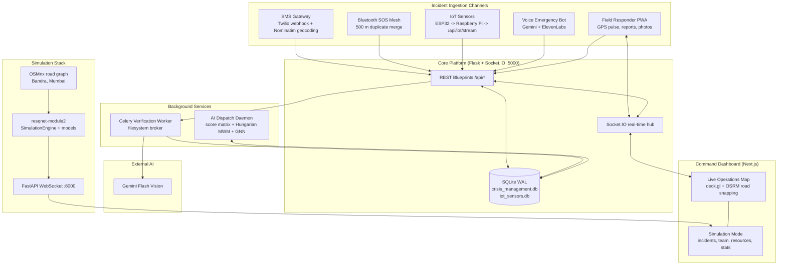

# ResQNet System Architecture

This document describes the whole-project system architecture for ResQNet.

## 1. System Context

ResQNet is an integrated emergency response platform involving:
- **Actors**: Citizen, Dispatcher/Commissioner, Field Responder, IoT Device, Mesh Device.
- **External Services**: 
  - Twilio (SMS Gateway)
  - Nominatim (Geocoding)
  - Gemini / ElevenLabs (Voice Emergency Bot)
  - OSRM (Road Snapping & Routing)
  - CartoDB / OSMnx (Mapping & Visualization)

## 2. Container / Component Diagram

## 3. Runtime Topology & Ports
- **Backend API & Real-time**: Flask + Socket.IO on port `5000`
- **Simulation Engine Bridge**: FastAPI on port `8000`
- **Frontend Dashboard**: Next.js
- **Background Workers**: Python daemon (`ai_dispatch_worker.py`) & Celery tasks

## 4. Incident-Ingestion Channels
- **SMS**: Via Twilio webhook, utilizing Nominatim for converting location data.
- **Bluetooth SOS Mesh**: Mesh networking with a 500-meter threshold for deduplication.
- **IoT Thresholds**: ESP32 and Raspberry Pi streaming via `/api/iot/stream`.
- **Voice Bot**: Uses Gemini and ElevenLabs for natural language emergency reporting.
- **Responder PWA**: Uploads field reports, photos, and live GPS pulses.

## 5. Data Model

- `incidents`: Main registry of reported emergencies.
- `personnel`: Responders, mapped to their active incident.
- `resources`: Vehicles and equipment, tracked by status and location.
- `incident_timeline`: Audit trail for every action (dispatch, arrival, completion).
- `attachments`: Media associated with reports.
- `communications`: Inter-agency comms.
- `alerts`: Broadcasts and notifications.
- `geofence_zones`: High-risk polygons.

## 6. Implementation Status Matrix
- **Implemented & Integrated**: AI dispatch with GNN & Hungarian MWM, Utility & Fairness scoring, Travel Physics, WebSocket synchronization, Incident Ingestion, AI Image verification.
- **Prototype / External**: Hardware IoT stream simulation, Twilio external dependencies.
