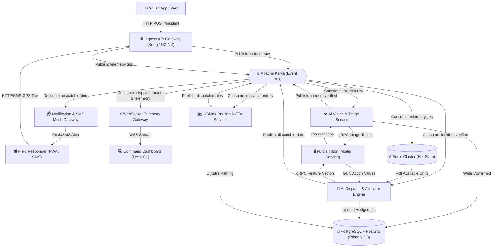
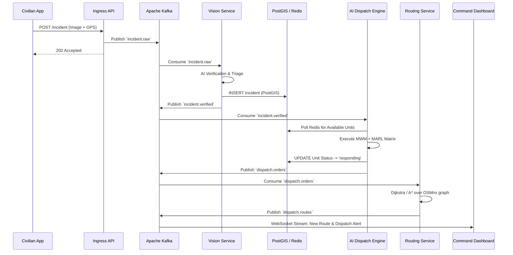

# ResQNet Distributed Microservices Architecture Specification

This document details the transition from the prototype ResQNet monolith into a resilient, event-driven microservices mesh designed for high-availability cloud deployment. It defines the exact services, data flows, and message broker topologies required to handle nation-scale crisis telemetry.

---

## 1. System Architecture & Data Flow Diagram (DFD)

The architecture is centered around an **Event-Driven Backbone (Apache Kafka)**. Services do not call each other synchronously (which risks cascading failures during traffic spikes); instead, they produce and consume state events.



---

## 2. Defined Microservices

### 2.1 Ingress API Gateway (Stateless)
* **Protocol**: HTTP/2, REST.
* **Role**: Authenticates JWTs, rate-limits endpoints (preventing DDoS), and acts as a dumb proxy that immediately dumps payloads into Kafka.
* **Tech Stack**: Kong, NGINX, or AWS API Gateway.

### 2.2 AI Vision & Triage Service (GPU-Accelerated)
* **Role**: Consumes unverified reports, runs duplicate detection (ResNet embeddings + Cosine similarity), and classifies disaster severity.
* **Data Flow**: Drops spam/deepfakes. Promotes legitimate crises to `incident.verified`.

### 2.3 AI Dispatch & Allocator Engine (CPU/RAM-Heavy)
* **Role**: The core logic (Hierarchical MARL, MCFP, Hungarian Algorithm).
* **Execution**: 
  * *Thread A (Strategic)*: Runs every 60s, queries PostGIS for regional data, computes macro-quotas.
  * *Thread B (Tactical)*: Triggers immediately when `incident.verified` is consumed, or every 3s. Reads live unit locations from Redis, queries Nvidia Triton for GNN refinement, solves MWM, and emits `dispatch.orders`.

### 2.4 OSMnx Routing & ETA Service (Compute-Heavy)
* **Role**: Listens for `dispatch.orders`. Loads physical street graphs from memory/PostGIS, calculates exact turn-by-turn Dijkstra paths, and emits `dispatch.routes`.

### 2.5 WebSocket Telemetry Fleet (High Concurrency)
* **Role**: Maintains persistent WebSocket connections with thousands of Commander Dashboards. Subscribes to Kafka telemetry streams and broadcasts state at 1Hz.
* **Tech Stack**: FastAPI / Node.js Socket.io, backed by Redis Pub/Sub for horizontal scaling.

---

## 3. Exact Data Payloads & Kafka Topics

### Topic: `incident.raw`
Generated when a user reports a crisis.
```json
{
  "event_id": "req-9982-uuid",
  "timestamp": "2026-10-06T14:32:01Z",
  "source": "civilian_app",
  "payload": {
    "lat": 19.0760,
    "lng": 72.8777,
    "user_description": "Building collapsed, fire visible",
    "image_s3_url": "s3://resqnet-media/raw/img_9982.jpg"
  }
}
```

### Topic: `incident.verified`
Generated by the Vision Service after confirming the incident is real.
```json
{
  "incident_id": "INC-B-449",
  "timestamp": "2026-10-06T14:32:04Z",
  "ai_confidence": 0.94,
  "category": "structural_fire",
  "severity_level": "critical",
  "derived_requirements": {
    "fire_engine": 2,
    "paramedic": 1
  },
  "location": {
    "type": "Point",
    "coordinates": [72.8777, 19.0760]  // GeoJSON format for PostGIS
  }
}
```

### Topic: `telemetry.gps`
Fired at 1Hz by field units or via SMS gateway batch-sync.
```json
{
  "unit_id": "AMB-204",
  "timestamp": "2026-10-06T14:32:05Z",
  "status": "available",
  "lat": 19.0710,
  "lng": 72.8700,
  "heading": 45.2,
  "fuel_level": 0.85
}
```
*(This is immediately UPSERTed into the Redis Cluster under the key `unit:AMB-204:location` for instant O(1) reads by the Dispatch Engine).*

### Topic: `dispatch.orders`
Generated by the AI Dispatch Engine once the Hungarian algorithm concludes.
```json
{
  "dispatch_id": "DSP-1192",
  "timestamp": "2026-10-06T14:32:06Z",
  "incident_id": "INC-B-449",
  "unit_id": "AMB-204",
  "assignment_logic": {
    "distance_km": 0.92,
    "strategic_penalty": 0.0,
    "mwm_score": 2.84,
    "synergy_bundle": true
  }
}
```

---

## 4. Sequence Diagram: The Dispatch Lifecycle



---

## 5. Database Strategy details

### PostgreSQL with PostGIS (Source of Truth)
- **Tables**: `incidents`, `personnel`, `resources`, `dispatch_history`.
- **Spatial Indexes**: GiST (Generalized Search Tree) indexes on location columns `USING GIST (geom)`. This allows the Dispatch engine to run fast bounding box queries (e.g., `ST_DWithin`) to filter out responders who are completely out of range before running the $O(V^3)$ Hungarian matrix.
- **Connection Pooling**: PgBouncer sits in front of PostGIS to handle thousands of microservice connections.

### Redis Cluster (Hot State)
- **Structure**: Uses Redis Geospatial hashes (`GEOADD`, `GEORADIUS`).
- **Purpose**: A relational DB is too slow for 1Hz GPS telemetry from 5,000 firetrucks. Redis maintains the exact real-time state of the world in RAM, allowing the AI engine to pull the active map instantly.
