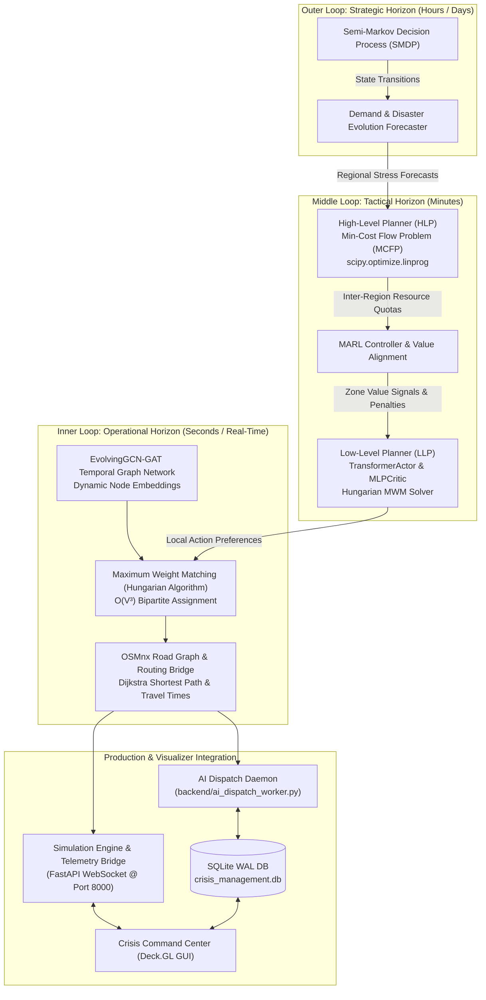
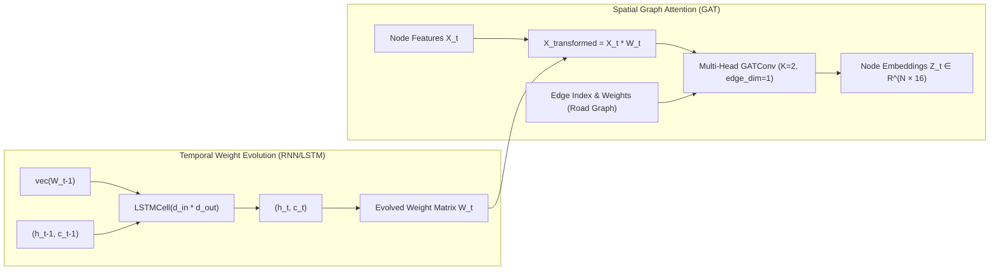
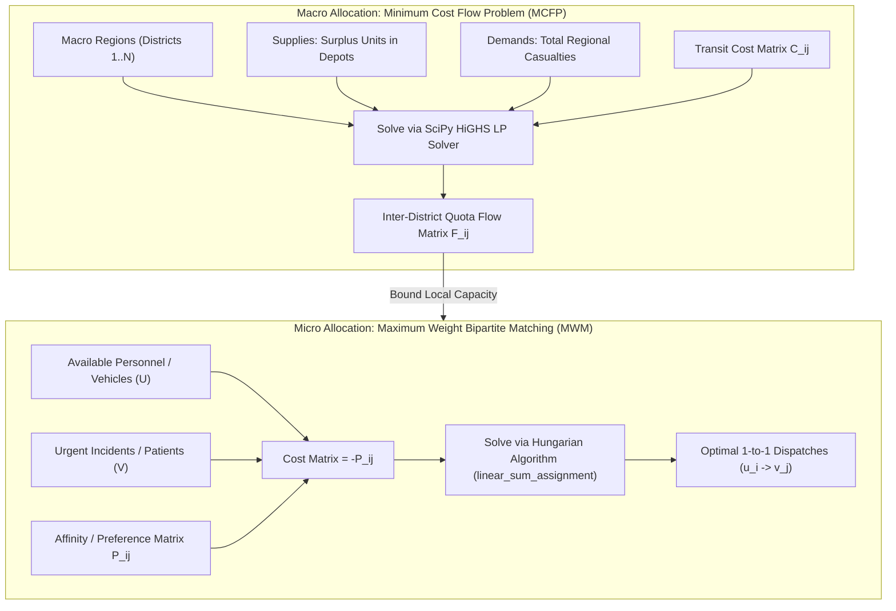
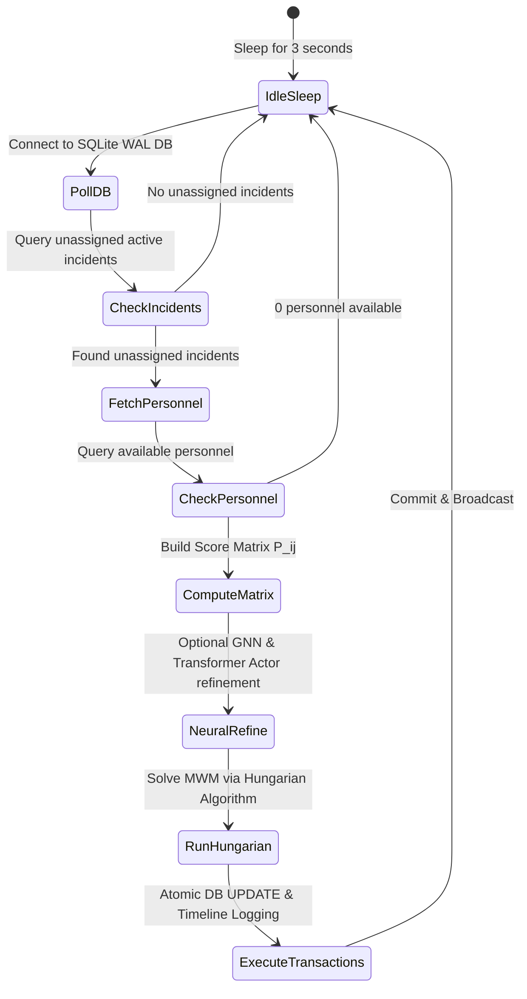

# ResQNet AI Resource Allocation Engine: Comprehensive Technical Specification

> [!NOTE]
> **Document Status**: Production Architecture & Mathematical Specification  
> **Target Subsystem**: ResQNet Module 2 (`resqnet-module2`), Production AI Daemon (`backend/ai_dispatch_worker.py`), Simulation Streaming Engine (`resqnet-visualizer/backend/app/engine_bridge.py`)

---

## 1. Executive Summary & Problem Formulation

In mass-casualty events, urban flooding, structural fires, and regional earthquakes, emergency management systems suffer from three catastrophic bottlenecks:
1. **The Static Allocation Fallacy**: Conventional dispatch assumes road networks and emergency priorities remain static, ignoring dynamic bridge collapses, flash floods, and secondary explosions.
2. **Resource Silos & Disjoint Synergies**: First responder agencies (Emergency Medical Services, Fire & Rescue, Law Enforcement) operate under fragmented command, failing to exploit multi-unit synergy (e.g., a Fire Truck containing a fire while an Ambulance evacuates burn victims).
3. **Inequity in Resource Distribution**: Purely efficiency-maximizing heuristics starve peripheral or vulnerable demographic sectors, violating ethical and humanitarian mandates.

The **ResQNet Resource Allocation Engine** solves these problems using a **Hierarchical Three-Loop Multi-Agent Reinforcement Learning (MARL)** architecture coupled with **Dynamic Graph Neural Networks (EvolveGCN-GAT)**, **Minimum Cost Flow Programming (MCFP)**, and **Maximum Weight Bipartite Matching (MWM)**.

---

## 2. End-to-End System Architecture

The engine is structured as a hierarchical control pyramid operating across three distinct temporal horizons:



---

## 3. Mathematical Formulations & Objective Theory

### 3.1 Non-Linear Utility Function with Viability Thresholds & Synergy

Let the disaster operational environment consist of $N$ demand zones (incidents) and $M$ discrete resources (personnel, vehicles, equipment).

#### Variables:
- $A_{ij} \in [0, 1]$: Normalized allocation of resource $j$ to incident $i$.
- $E_{ij} \in [0, 1]$: Domain effectiveness of resource $j$ against incident $i$'s emergency type.
- $c_j \in \{0, 1, 2\}$: Resource category label ($0 = \text{Personnel}$, $1 = \text{Vehicles}$, $2 = \text{Equipment}$).
- $P_i^{\text{survival}} \in (0, 1]$: Zone-level survival probability multiplier based on elapsed response time.
- $D_i^{\max} \in \mathbb{R}^+$: Maximum demand capacity ceiling for incident $i$.

#### Step 1: Smooth Sigmoidal Viability Threshold
A fractional resource (e.g., half an ambulance or an isolated medic without tools) cannot function effectively. We pass the allocation $A_{ij}$ through a parameterized sigmoid gating function:

$$\text{eff\_allocation}_{ij} = A_{ij} \cdot \sigma\left(k (A_{ij} - \tau)\right) = A_{ij} \cdot \frac{1}{1 + e^{-k(A_{ij} - \tau)}}$$

*Standard Parameters*: Steepness $k = 5.0$, Viability Threshold $\tau = 0.5$.

#### Step 2: Sub-Linear Base Utility (Diminishing Marginal Returns)
Adding the tenth fire engine to an extinguished fire yields diminishing returns. We model this using a concave power-law function with exponent $\alpha < 1.0$:

$$\text{BaseUtility}_i = \sum_{j=1}^{M} E_{ij} \cdot \left(\text{eff\_allocation}_{ij}\right)^\alpha$$

*Standard Parameter*: $\alpha = 0.6$.

#### Step 3: Multi-Category Tiered Synergy
When heterogeneous response categories operate together, their combined impact is super-additive:

$$\text{is\_present}_{ij} = \mathbb{I}\left(A_{ij} \ge \tau\right)$$

$$\text{cat\_active}_{i, c} = \bigvee_{j: c_j = c} \text{is\_present}_{ij}, \quad \forall c \in \{0, 1, 2\}$$

$$N_i^{\text{cat}} = \sum_{c=0}^2 \text{cat\_active}_{i, c}$$

The synergy multiplier $S_i$ is structured as a discrete piecewise step function:

$$S_i = \begin{cases} 
1.00 & \text{if } N_i^{\text{cat}} \le 1 \\
1.10 & \text{if } N_i^{\text{cat}} = 2 \quad \text{(e.g., Personnel + Vehicles)} \\
1.15 & \text{if } N_i^{\text{cat}} = 3 \quad \text{(Personnel + Vehicles + Specialized Equipment)}
\end{cases}$$

#### Step 4: Bounded Incident Utility
The total realized utility $U_i$ is bounded by the incident's physical demand ceiling:

$$U_i = \min\left(\text{BaseUtility}_i \cdot S_i \cdot P_i^{\text{survival}}, \; D_i^{\max}\right)$$

---

### 3.2 Ethical Fairness & Multi-Objective Scalarization

To eliminate spatial starvation and prevent emergency assets from favoring only affluent or proximate districts, ResQNet integrates Rawlsian distributive justice and the Gini coefficient.

#### Need-Adjusted Fulfillment Ratio
For each incident $i$, let $\Phi_i \in [0, 1]$ denote the Socio-Economic Vulnerability Index (e.g., population density, elderly ratio, lack of private transport). The adjusted fulfillment ratio $f_i$ is:

$$f_i = \frac{U_i}{D_i^{\max} \cdot \left(1.0 + \omega \cdot \Phi_i\right) + \epsilon}$$

*Standard Parameters*: Vulnerability weight $\omega = 0.5$, stabilizer $\epsilon = 10^{-8}$.

#### Gini Inequality Metric
The Gini coefficient of fulfillment ratios across all $n$ active incidents measures inter-zone allocation inequality:

$$G = \frac{\sum_{i=1}^n \sum_{j=1}^n |f_i - f_j|}{2 n^2 (\bar{f} + \epsilon)}, \quad \text{where } \bar{f} = \frac{1}{n}\sum_{i=1}^n f_i$$

- $G = 0$: Perfect equality across all crisis zones.
- $G \to 1$: Extreme concentration of aid in a subset of zones.

#### Scalarized Global Objective Function
The optimization objective balances three competing societal imperatives:

$$J = w_{\text{eff}} \cdot \mathcal{E} + w_{\text{fair}} \cdot (1.0 - G) + w_{\min} \cdot \min_{i \in \{1 \dots n\}} (f_i)$$

Where:
- **System Efficiency**: $\mathcal{E} = \frac{\sum_{i=1}^n U_i}{\sum_{i=1}^n D_i^{\max} + \epsilon}$
- **Equitable Distribution**: $1.0 - G$ (Gini equality score)
- **Rawlsian Max-Min Principle**: $\min_i (f_i)$ (Guarantees the single worst-off community receives non-zero support)
- **Default Weights**: $w_{\text{eff}} = 0.4$, $w_{\text{fair}} = 0.4$, $w_{\min} = 0.2$ ($w_{\text{eff}} + w_{\text{fair}} + w_{\min} = 1.0$).

---

## 4. Deep Learning & Neural Architectures

### 4.1 EvolveGCN-GAT: Spatio-Temporal Graph Neural Network

ResQNet models the urban crisis area as a dynamic graph $\mathcal{G}_t = (\mathcal{V}, \mathcal{E}_t, X_t, W_e)$, where:
- Nodes $v \in \mathcal{V}$: Road intersections, depots, hospitals, fire stations, and incident locations.
- Edges $(u, v) \in \mathcal{E}_t$: Navigable road segments (dynamically toggled if flooded, blocked, or damaged).
- Node Features $X_t \in \mathbb{R}^{|\mathcal{V}| \times d_{\text{in}}}$: Local casualty count, incident type, resource supplies, and elevation.
- Edge Attributes $W_e \in \mathbb{R}^{|\mathcal{E}_t| \times 1}$: Real-world road segment length / traversal cost.

#### Temporal Parameter Evolution via LSTM
Traditional GCNs keep convolution weights static. ResQNet uses an **LSTMCell** to evolve the graph convolution weights $W_t \in \mathbb{R}^{d_{\text{in}} \times d_{\text{out}}}$ as topological crisis dynamics unfold:

$$(h_t, c_t) = \text{LSTMCell}\left(\text{vec}(W_{t-1}), \; (h_{t-1}, c_{t-1})\right)$$

$$W_t = \text{reshape}\left(h_t, \; (d_{\text{in}}, d_{\text{out}})\right)$$

#### Graph Attention Aggregation (GAT with Edge Attributes)
Nodes transform their features via the evolved weight tensor: $X'_t = X_t W_t$.  
Then, multi-head attention scores $\alpha_{uv}^{(k)}$ between connected nodes $u$ and $v$ are computed incorporating edge travel delay $e_{uv}$:

$$\alpha_{uv}^{(k)} = \frac{\exp\left(\text{LeakyReLU}\left(\mathbf{a}^{(k)T} \left[ W_t x_u \parallel W_t x_v \parallel W_e e_{uv} \right]\right)\right)}{\sum_{w \in \mathcal{N}(u)} \exp\left(\text{LeakyReLU}\left(\mathbf{a}^{(k)T} \left[ W_t x_u \parallel W_t x_w \parallel W_e e_{uw} \right]\right)\right)}$$

$$\mathbf{z}_u = \Vert_{k=1}^K \sigma\left(\sum_{v \in \mathcal{N}(u)} \alpha_{uv}^{(k)} W_t x_v\right)$$

*Layer Dimensions*: $d_{\text{in}} = 3$ (type, severity, demand ratio), $d_{\text{out}} = 16$, $K = 2$ attention heads.



---

### 4.2 Transformer Actor (`TransformerActor`)

To map varying numbers of responders to dynamically changing incident locations, the policy network is designed as a **Permutation-Invariant Transformer Encoder**:

- **Input**: Sequence of responder node embeddings $Z_{\text{resp}} \in \mathbb{R}^{B \times N_{\text{resp}} \times d_{\text{state}}}$.
- **Architecture**:
  1. Linear Projection: $d_{\text{state}} \to d_{\text{hidden}} = 128$.
  2. Multi-Head Self-Attention: 2 Transformer Encoder layers, 4 attention heads, feedforward dimension 256, LayerNorm, Dropout ($p=0.1$).
  3. Action Output Head: Linear layer projecting to preference scores over $N_{\text{depots}}$ or $N_{\text{incidents}}$.
  4. Action Masking: Adds negative infinity penalties $\mathcal{M}_{ij} = -\infty$ to legally invalid actions (e.g., unit already assigned, route impassable).
  5. Softmax Normalization:
     $$\pi(a_j \mid s_i) = \frac{\exp\left(\text{logit}_{ij} + \mathcal{M}_{ij}\right)}{\sum_{k} \exp\left(\text{logit}_{ik} + \mathcal{M}_{ik}\right)}$$

### 4.3 Multi-Layer Perceptron Critic (`MLPCritic`)

The centralized critic estimates the expected multi-objective return $Q(s, a)$:
- **Input**: Concatenation of state vector and joint action vector: $x = [s \parallel a] \in \mathbb{R}^{d_{\text{state}} + d_{\text{action}}}$.
- **Architecture**:
  $$\text{FC}_1(d_{\text{in}} \to 256) \to \text{ReLU} \to \text{FC}_2(256 \to 256) \to \text{ReLU} \to \text{FC}_3(256 \to 1)$$
- **Output**: Scalar state-action value $Q(s, a)$.

---

## 5. Algorithmic Solvers: MCFP & MWM

ResQNet separates allocation into a coarse-grained linear flow problem and a fine-grained combinatorial matching problem:



### 5.1 High-Level Planner: Min-Cost Flow Problem (MCFP)

The High-Level Planner balances macro-regions using Linear Programming:

$$\min \sum_{i=1}^n \sum_{j=1}^n c_{ij} x_{ij}$$

Subject to:
1. Supply Constraints: $\sum_{j=1}^n x_{ij} \le s_i \quad \forall i$ (Surplus available at region $i$)
2. Demand Constraints: $\sum_{i=1}^n x_{ij} = d_j \quad \forall j$ (Exact units required at region $j$)
3. Non-negativity: $x_{ij} \ge 0 \quad \forall i, j$

*Solver Implementation*: Implemented via `scipy.optimize.linprog(method='highs')` with flattened coefficient vectors and equality/inequality constraint matrices.

---

### 5.2 Low-Level Planner: Maximum Weight Matching (MWM)

Let $\mathcal{U} = \{u_1, \dots, u_m\}$ be available first responders and $\mathcal{I} = \{i_1, \dots, i_k\}$ be unassigned incidents. The preference matrix $P_{uj}$ represents the matching affinity between responder $u$ and incident $j$.

#### Multi-Factor Matching Score Matrix:
$$P_{uj} = w_{\text{dist}} \cdot \mathcal{S}_{\text{dist}}(u, j) + w_{\text{role}} \cdot \mathcal{S}_{\text{role}}(u, j) + w_{\text{sev}} \cdot \mathcal{S}_{\text{sev}}(j)$$

Where:
- **Distance Factor**: $\mathcal{S}_{\text{dist}}(u, j) = \frac{1.0}{1.0 + d_{\text{haversine}}(u, j)}$
- **Role Affinity Factor**: 
  $$\mathcal{S}_{\text{role}}(u, j) = \begin{cases}
  2.0 - (0.4 \times \text{rank}) & \text{if role in affinity list for incident type} \\
  0.5 & \text{otherwise}
  \end{cases}$$
- **Severity Multiplier**:
  $$\mathcal{S}_{\text{sev}}(j) = \begin{cases}
  3.0 & \text{Critical} \\
  2.0 & \text{High} \\
  1.2 & \text{Medium} \\
  0.8 & \text{Low}
  \end{cases}$$
- **Weights**: $w_{\text{dist}} = 0.4$, $w_{\text{role}} = 0.4$, $w_{\text{sev}} = 0.2$.

#### The Hungarian Inversion
To maximize total matching score using standard bipartite matching algorithms, the score matrix is negated to form a non-negative cost matrix:

$$\mathcal{C}_{uj} = -P_{uj}$$

$$\min \sum_{u} \sum_{j} \mathcal{C}_{uj} y_{uj} \quad \text{s.t.} \quad \sum_j y_{uj} \le 1, \; \sum_u y_{uj} \le 1, \; y_{uj} \in \{0, 1\}$$

*Solver Implementation*: Solved in $O(V^3)$ polynomial time using Kuhn-Munkres (Hungarian algorithm) via `scipy.optimize.linear_sum_assignment(cost_matrix)`.

---

## 6. Real-World Road Graph Routing & Dijkstra Bridge

### 6.1 Road Network Integration via OSMnx

The simulation and inner loop load real-world OpenStreetMap topologies using `osmnx` and `networkx`:
1. Road networks are downloaded as directed multidigraphs with real GPS coordinates, street types, and segment lengths.
2. Intersections form graph vertices $V$.
3. When incidents or units are placed at GPS coordinates $(\text{lat}, \text{lng})$, they are projected to the nearest network node using a spatial KD-tree:
   $$v^* = \arg\min_{v \in V} d_{\text{euclidean}}\left((\text{lat}_v, \text{lng}_v), \; (\text{lat}_{\text{target}}, \text{lng}_{\text{target}})\right)$$

### 6.2 Shortest Path & Travel Duration Physics
Vehicle trajectories follow physical road coordinates via Dijkstra's shortest path:

$$\text{Route}(u, i) = \text{DijkstraShortestPath}\left(\mathcal{G}_{\text{road}}, \; v_u, \; v_i, \; \text{weight} = \text{'length'}\right)$$

Travel time duration in simulation ticks is computed based on vehicle type capabilities:

$$\text{DurationTicks} = \max\left(1, \; \left\lceil \frac{\text{PathLengthMeters}}{\text{VelocityMPS} \times \text{SecondsPerTick}} \right\rceil\right)$$

- Ambulance Velocity: $14.0\text{ m/s}$ ($\sim 50\text{ km/h}$)
- Fire Engine Velocity: $11.0\text{ m/s}$ ($\sim 40\text{ km/h}$)
- Police Patrol Velocity: $16.5\text{ m/s}$ ($\sim 60\text{ km/h}$)

---

## 7. Production Background Worker Daemon (`backend/ai_dispatch_worker.py`)

In production, the engine runs as an autonomous, persistent operating system background service:



### Key Production Engineering Safeguards:
1. **SQLite WAL Concurrency**: Configures `PRAGMA journal_mode=WAL` and `PRAGMA busy_timeout=30000` to prevent database lock collisions between Flask web requests, Celery tasks, and the dispatch worker.
2. **Atomic State Upgrades**: Updates personnel status to `'responding'` and incident assignment inside a single `BEGIN IMMEDIATE` transaction.
3. **Audit Trail Logging**: Appends a transparent timeline entry to `incident_timeline` recording the matching score, distance, and role rationale.
4. **Resilience & Fallbacks**: If PyTorch or CUDA libraries are missing, the daemon automatically falls back to exact algorithmic Hungarian matching without crashing.

---

## 8. Simulation WebSocket Engine Bridge (`engine_bridge.py`)

The visualizer connects to a high-performance **FastAPI WebSocket** streaming ticks at 1.0s intervals:

```json
{
  "tick": 14,
  "state_summary": {
    "busy_units": 8,
    "hospital_load": 0.80,
    "fire_station_load": 0.60,
    "police_station_load": 0.40,
    "active_incidents_count": 4
  },
  "active_incidents": [
    {
      "id": "INC-4a12",
      "type": "Fire",
      "severity": 4,
      "requirements": {"Fire Truck": 2, "Ambulance": 1},
      "remaining_requirements": {"Fire Truck": 1, "Ambulance": 0},
      "location": {"lon": 72.834, "lat": 19.062}
    }
  ],
  "dispatches": [
    {
      "unit_id": "Fir-0",
      "unit_type": "Fire Truck",
      "incident_id": "INC-4a12",
      "distance": 842.5,
      "calculated_duration_ticks": 4,
      "synergy_bundle": true,
      "reasoning": "Dispatched Fire Truck 'Fir-0' to Fire 'INC-4a12'. Optimal travel: 842.5m. Synergy bundle active with Paramedic unit.",
      "path": [{"lon": 72.831, "lat": 19.060, "timestamp": 14.0}, "..."]
    }
  ]
}
```

---

## 9. Comprehensive Comparison Table: ResQNet vs Conventional Baselines

| Dimension | Nearest Neighbor (Greedy) | Round Robin | Static MIP / LP | ResQNet Engine (Ours) |
|---|---|---|---|---|
| **Optimization Criteria** | Distance only | Queue length | Single snapshot cost | Multi-objective (Efficiency, Fairness, Survival) |
| **Dynamic Graph Evolution** | ❌ None | ❌ None | ❌ Static graph | ✅ **EvolveGCN-GAT (LSTM weights)** |
| **Multi-Unit Synergy** | ❌ No concept | ❌ No concept | ⚠️ Difficult non-linearities | ✅ **Sigmoidal Tiered Synergy ($S_i$)** |
| **Distributive Fairness** | ❌ Severe starvation | ⚠️ Blind round-robin | ⚠️ Hard linear bounds | ✅ **Rawlsian Max-Min + Gini ($1 - G$)** |
| **Execution Latency** | $< 5\text{ ms}$ | $< 1\text{ ms}$ | $500 - 5000\text{ ms}$ (timeout risk) | ✅ **$< 20\text{ ms}$ (Hungarian polynomial)** |
| **Road Snapping** | ❌ Euclidean straight lines | ❌ Euclidean | ⚠️ Static distance table | ✅ **OSMnx / OSRM physical street grid** |
| **Explainability** | ❌ None | ❌ None | ❌ Blackbox dual variables | ✅ **Natural language reasoning logs** |

---

## 10. Summary of Key Files & Symbols

- **`resqnet/core/utility.py`**: [`calculate_utility`](file:///D:/Codeathon/resqnet-module2/resqnet/core/utility.py#L3-L50)
- **`resqnet/core/fairness.py`**: [`calculate_gini`](file:///D:/Codeathon/resqnet-module2/resqnet/core/fairness.py#L3-L18), [`calculate_scalarized_objective`](file:///D:/Codeathon/resqnet-module2/resqnet/core/fairness.py#L19-L42)
- **`resqnet/models/evolve_gcn.py`**: [`EvolvingGCNConv`](file:///D:/Codeathon/resqnet-module2/resqnet/models/evolve_gcn.py#L5-L35)
- **`resqnet/models/transformer_actor.py`**: [`TransformerActor`](file:///D:/Codeathon/resqnet-module2/resqnet/models/transformer_actor.py#L5-L37)
- **`resqnet/models/mlp_critic.py`**: [`MLPCritic`](file:///D:/Codeathon/resqnet-module2/resqnet/models/mlp_critic.py#L4-L23)
- **`resqnet/middle_loop/hlp_agent.py`**: [`HighLevelPlanner.solve_mcfp`](file:///D:/Codeathon/resqnet-module2/resqnet/middle_loop/hlp_agent.py#L4-L35)
- **`resqnet/middle_loop/llp_agent.py`**: [`LowLevelPlanner.solve_mwm`](file:///D:/Codeathon/resqnet-module2/resqnet/middle_loop/llp_agent.py#L4-L22)
- **`resqnet/evaluation/reasoning.py`**: [`DispatchExplainer`](file:///D:/Codeathon/resqnet-module2/resqnet/evaluation/reasoning.py#L1-L11)
- **`backend/ai_dispatch_worker.py`**: [`AIDispatchWorker`](file:///D:/Codeathon/backend/ai_dispatch_worker.py#L74-L320)
- **`resqnet-visualizer/backend/app/engine_bridge.py`**: [`SimulationBridge`](file:///D:/Codeathon/resqnet-visualizer/backend/app/engine_bridge.py#L25-L208)
